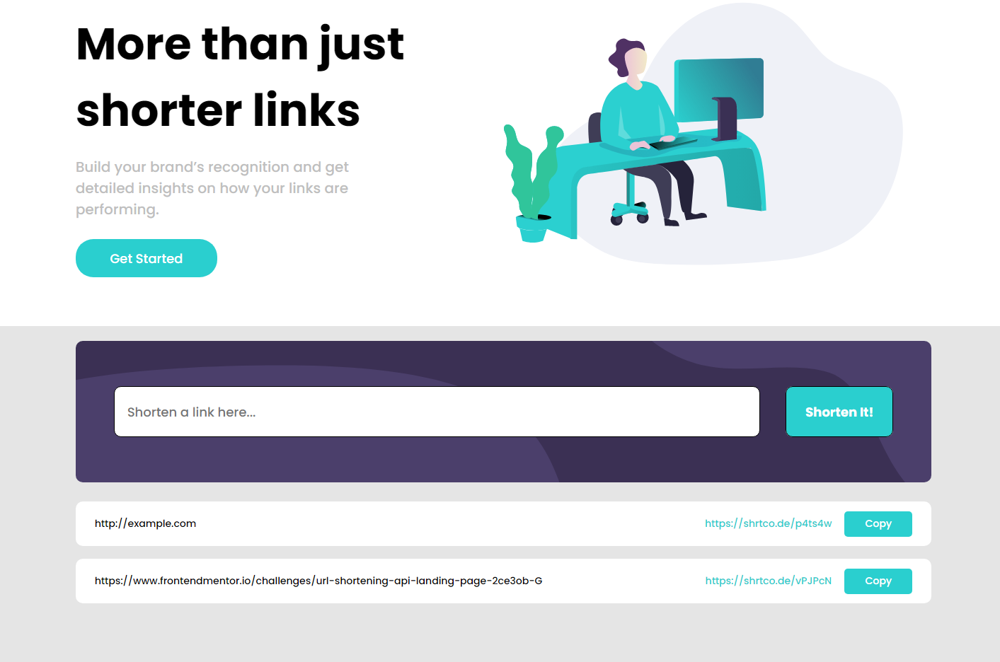

# Frontend Mentor - Shortly URL shortening API Challenge solution

This app shortens a given URL and allows user to copy the new returned link. The shortened links are kept in session. All other buttons are cosmetic only.  
The app uses shortening API from https://app.shrtco.de/

This is a solution to the [Shortly URL shortening API Challenge challenge on Frontend Mentor](https://www.frontendmentor.io/challenges/url-shortening-api-landing-page-2ce3ob-G). Frontend Mentor challenges help you improve your coding skills by building realistic projects.

## Table of contents

- [Overview](#overview)
  - [The challenge](#the-challenge)
  - [Screenshot](#screenshot)
  - [Links](#links)
- [My process](#my-process)
  - [Built with](#built-with)

## Overview

### The challenge

Users should be able to:

- View the optimal layout for the site depending on their device's screen size
- Shorten any valid URL
- See a list of their shortened links, even after refreshing the browser
- Copy the shortened link to their clipboard in a single click
- Receive an error message when the `form` is submitted if:
  - The `input` field is empty

### Screenshot

### Links

- Solution URL: [Github](https://github.com/daniel88li/fm-challenge9)
- Live Site URL: [Github Pages](https://daniel88li.github.io/fm-challenge9/)

## My process

### Built with

- Semantic HTML5 markup
- CSS custom properties
- Flexbox
- Mobile-first workflow
- [React](https://reactjs.org/) - JS library
- [Font Awesome](https://fontawesome.com/) - React component version
- [SHRTCODE](https://app.shrtco.de/) - API to shorten links
